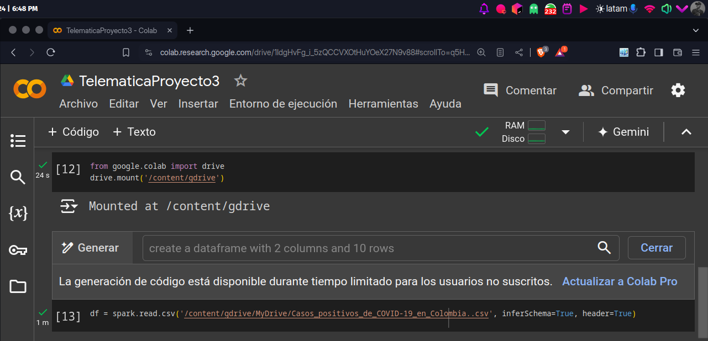

# Proyecto3
# ST0256 Tópicos Especiales en Telemática

## Estudiante:
- Nombre: David Fonseca Lara
- Correo: dfonsecal@eafit.edu.co

## Profesor:
- Nombre: Álvaro Ospina
- Correo: aeospinas@eafit.edu.co

# Proyecto 3 - Spark con Notebooks y PySpark
Este proyecto se enfoca en el uso de Spark con Notebooks y PySpark. Se hará uso de Google Colab para ejecutar PySpark.
En dataset que se usará es el de [Casos positivos de COVID 19 en Colombia](https://www.datos.gov.co/api/views/gt2j-8ykr/rows.csv?accessType=DOWNLOAD).

## 1. Subiendo los datos en Google Drive
Primero, se sube el archivo Casos_positivos_de_COVID-19_en_Colombia.csv a Google Drive. Este archivo contiene información sobre los casos positivos de COVID-19 en Colombia.

Además subí el acrhivo al colab y cree el dataframe leyéndolo

## 2. Análisis exploratorio de los datos
### 2.1 Listar columnas

