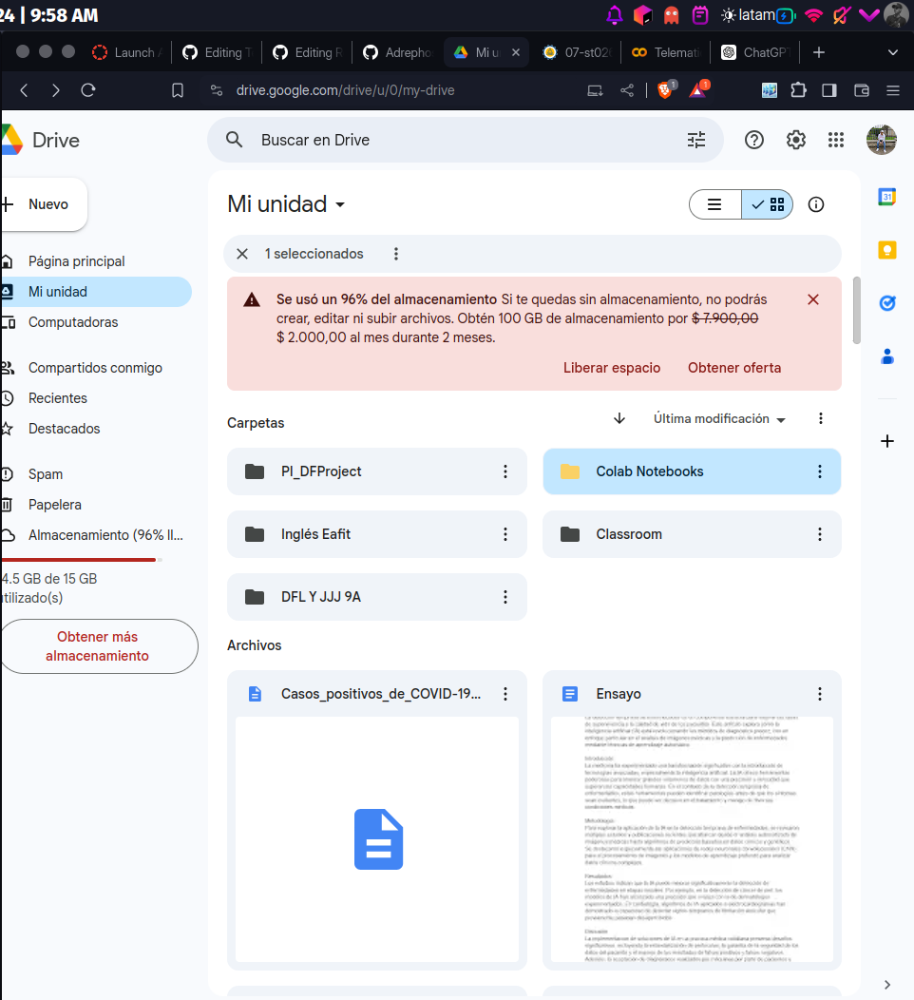
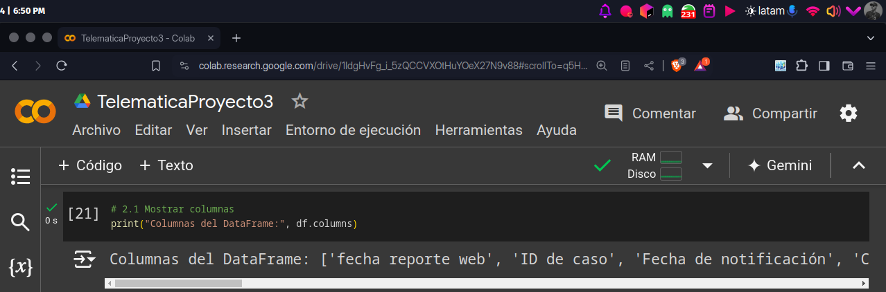

# Proyecto3
# ST0256 Tópicos Especiales en Telemática

## Estudiante:
- Nombre: David Fonseca Lara
- Correo: dfonsecal@eafit.edu.co

## Profesor:
- Nombre: Álvaro Ospina
- Correo: aeospinas@eafit.edu.co

# Proyecto 3 - Spark con Notebooks y PySpark
Este proyecto se enfoca en el uso de Spark con Notebooks y PySpark. Se hará uso de Google Colab para ejecutar PySpark.
En dataset que se usará es el de [Casos positivos de COVID 19 en Colombia](https://www.datos.gov.co/api/views/gt2j-8ykr/rows.csv?accessType=DOWNLOAD).

## 1. Subiendo los datos en Google Drive
Primero, se sube el archivo Casos_positivos_de_COVID-19_en_Colombia.csv a Google Drive. Este archivo contiene información sobre los casos positivos de COVID-19 en Colombia.

Además subí el acrhivo al colab y cree el dataframe leyéndolo

## 2. Análisis exploratorio de los datos
### 2.1 Listar columnas

### 2.2 Tipos de datos

### 2.3 Seleccionar algunas columnas

### 2.4 Renombrar columnas

### 2.5 Agregar columna

### 2.6 Borrar columnas

### 2.7 Filtrar datos

### 2.8 Ejecutar una función UDF

## 3. Preguntas de negocio
Formulamos las preguntas y almacenamos los resultados en un archivo CSV, que luego se guarda en S3.

### 3.1 Los 10 departamentos con más casos de COVID-19 ordenados de mayor a menor

### 3.2 Las 10 ciudades con más casos de COVID-19 ordenadas de mayor a menor

### 3.3 Los 10 días con más casos de COVID-19 ordenados de mayor a menor

### 3.4 Distribución de casos de COVID-19 por edades en Colombia

### 3.5 Distribución de casos de COVID-19 por departamentos en Colombia

## 4. Subir archivos a Amazon S3
Hacemos la conexión con el Bucket de AWS

Creamos la carpeta en el bucket llamada colab/

Transformé los df a CSV y los subí al bucket

Y verifiqué que hayan quedado en el bucket

## 5. Video
Se puede observar el video en este enlace: https://youtu.be/S0wN1VvXnI4

## 6. Conclusiones

- Primero, se subió el archivo Casos_positivos_de_COVID-19_en_Colombia.csv a Google Drive. Este archivo contiene los datos detallados sobre los casos positivos de COVID-19 en Colombia, permitiendo un análisis exhaustivo de la situación en el país.

- Luego, se formularon una serie de preguntas relevantes sobre los datos y se almacenaron las respuestas en un archivo CSV. Este archivo resultante fue posteriormente guardado en el servicio de almacenamiento en la nube de Amazon, S3.

- El análisis se extendió a varias dimensiones, incluyendo la distribución de casos por edad y por departamento, así como las fechas con mayor incidencia de casos. Estos análisis se reflejaron en varios archivos CSV.

- Cada archivo generado fue subido a S3, lo que facilitó la gestión y el acceso a los datos de manera segura y eficiente. El uso de S3 permitió mantener una estructura organizada y accesible para futuros análisis.

- Además, se mejoraron significativamente las habilidades en el uso de S3 en AWS y en el manejo de PySpark. Este proceso también incluyó una profundización en el concepto de dataframes, mejorando la capacidad de manipulación y análisis de grandes volúmenes de datos.

- Por último logré cumplir con todo lo propuesto por el proyecto
